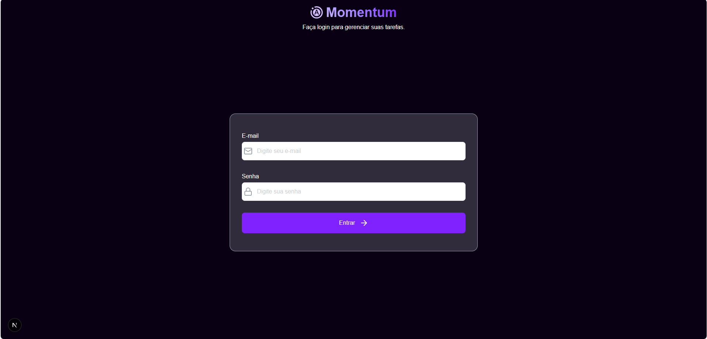
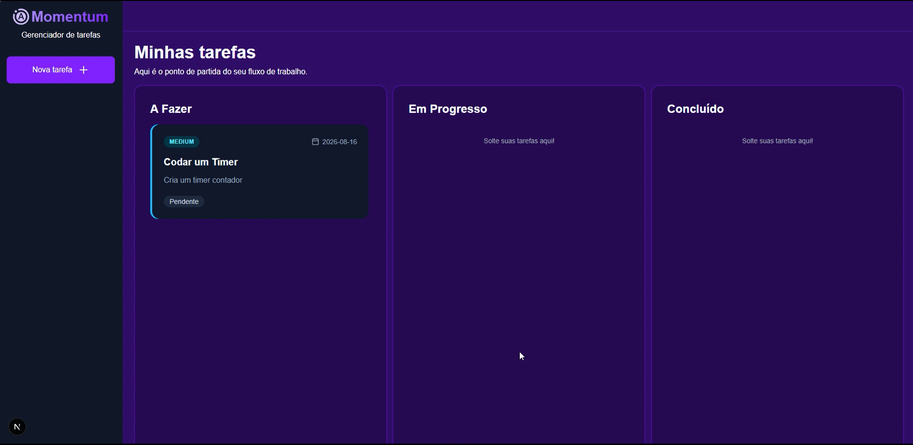
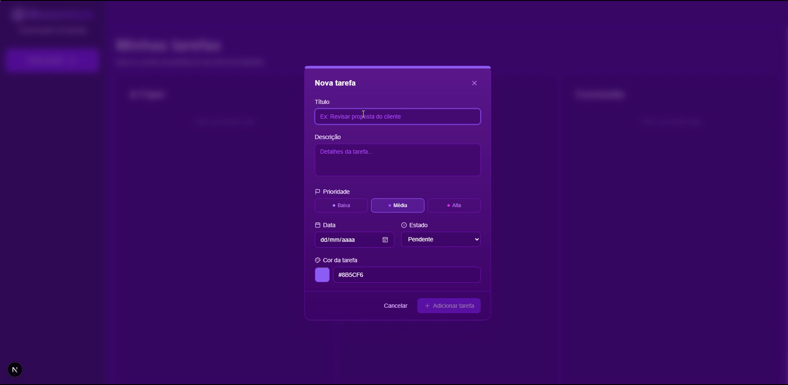
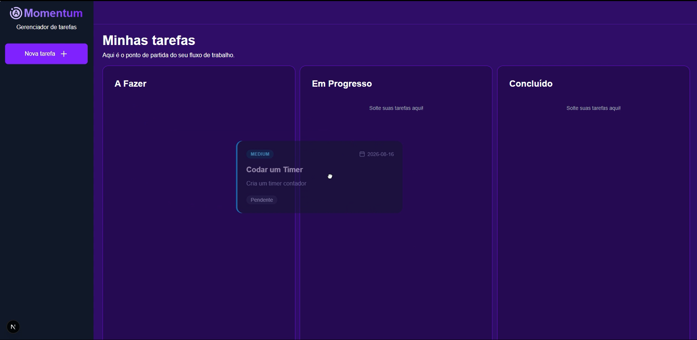

# ToDo List com Login

Aplicação web para gerenciar tarefas de forma organizada e visual, com autenticação simples, painel por etapas e suporte a drag and drop para mover itens entre diferentes status.

## Visão geral

Este projeto foi desenvolvido para facilitar o controle de tarefas diárias e atividades em andamento. A interface permite criar, visualizar e organizar tarefas por etapas, além de personalizar cada item com nome, descrição, data, status e cor.

## Funcionalidades

- Login com usuários simulados para autenticação local
- Criação de tarefas com nome, descrição, data, estado e cor
- Organização por etapas: pendente, em andamento e concluído
- Funcionalidade de drag and drop para mover tarefas entre colunas
- Interface visualmente organizada
- Persistência do estado local da sessão da aplicação

## Tecnologias utilizadas

- Next.js
- TypeScript
- Tailwind CSS
- dnd-kit

## Pré-requisitos

Antes de iniciar, certifique-se de ter instalado:

- Node.js 18 ou superior
- npm, yarn, pnpm ou bun

## Como executar

1. Clone o repositório:

```bash
git clone https://github.com/seu-usuario/todo-list-with-login.git
cd todo-list-with-login
```

2. Instale as dependências:

```bash
npm install
```

3. Inicie o servidor de desenvolvimento:

```bash
npm run dev
```

4. Acesse a aplicação no navegador:

```text
http://localhost:3000
```

## Usuários de demonstração

Como o projeto não possui banco de dados, a autenticação é feita com dados mockados no arquivo [src/data/users.ts](src/data/users.ts).

```ts
[
  {
    id: "1",
    name: "João Silva",
    email: "joao@teste.com",
    password: "123456",
  },
  {
    id: "2",
    name: "Maria Souza",
    email: "maria@teste.com",
    password: "123456",
  },
  {
    id: "3",
    name: "Admin",
    email: "admin@teste.com",
    password: "admin123",
  },
]
```

## Galeria do projeto

Abaixo estão espaços reservados para imagens e GIFs do projeto.

### Tela de login



### Dashboard principal



### Card de criação de tarefa


### Drag and Drop Tarefa


### GIF — criação de tarefa & arrastar tarefa entre etapas


## Autor

- Oliver Oliveira
- [LinkedIn](https://www.linkedin.com/in/oliver-oliveira-04347328a/)

## Recursos

- [Documentação do Next.js](https://nextjs.org/docs)
- [Aprenda Next.js](https://nextjs.org/learn)
- [Tailwind CSS](https://tailwindcss.com)
- [dnd-kit](https://dndkit.com)